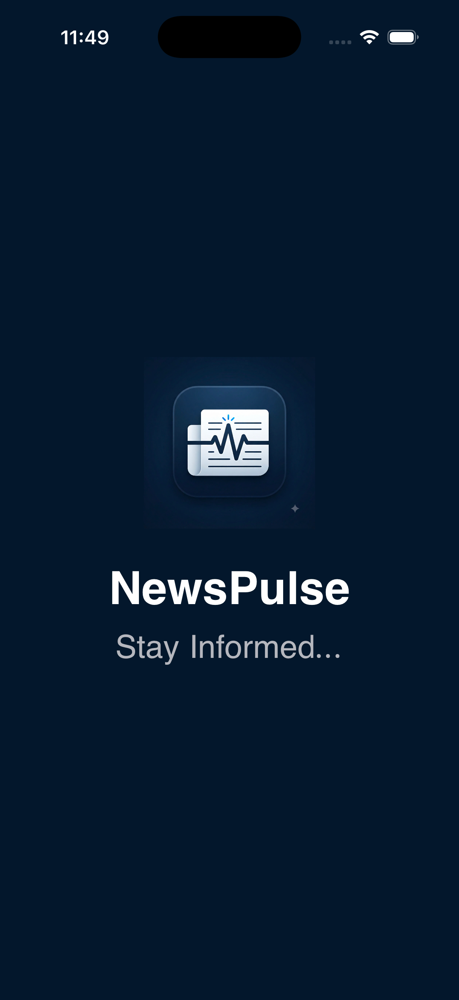
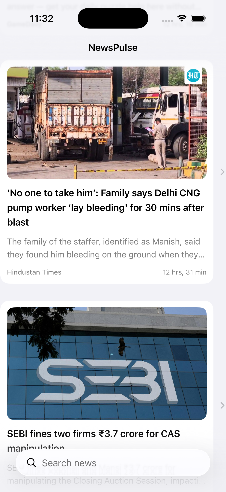
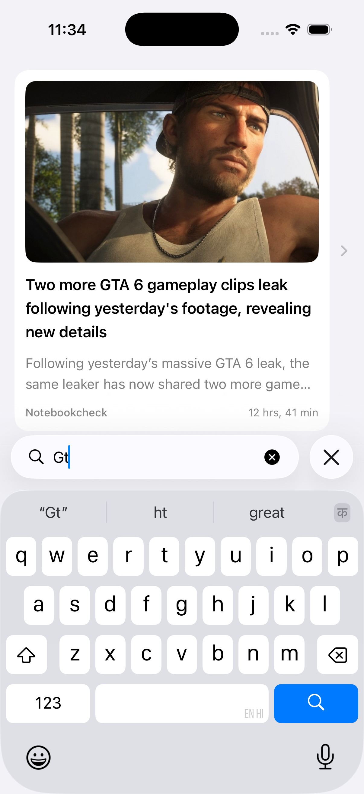
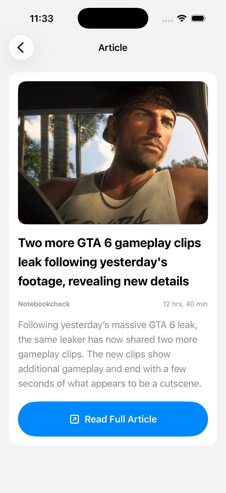

# NewsPulse

[](https://github.com/amghodke/NewsPulse/actions/workflows/ios-ci.yml)

NewsPulse is a modern iOS news application built with SwiftUI, MVVM, async/await, and protocol-based dependency injection.

The app fetches the latest news using the GNews API and demonstrates a clean, testable, and scalable iOS architecture suitable for a production-style portfolio project.

## Features

* Latest news feed
* News article images
* Article detail screen
* Search articles by title
* Pull-to-refresh
* Pagination / load more
* Relative publication time
* Placeholder image support
* Launch screen and custom app icon
* Error handling
* Unit testing
* UI testing
* Secure API key configuration

## Tech Stack

* Swift
* SwiftUI
* MVVM
* Observation Framework
* async/await
* URLSession
* Codable
* Protocol-Oriented Programming
* Dependency Injection
* XCTest
* XCUITest
* GNews API

## Architecture

NewsPulse follows an MVVM-based architecture with separation between networking, service, presentation, and UI layers.

```text
View
  ↓
ViewModel
  ↓
Service
  ↓
NetworkClient
  ↓
GNews API
```

The application uses protocols for services and networking components, which makes dependencies replaceable and easier to unit test.

## Project Structure

```text
NewsPulse
│
├── App
│
├── Models
│
├── Networking
│   ├── NetworkClient
│   ├── Endpoint
│   └── API Configuration
│
├── Services
│   └── NewsService
│
├── ViewModels
│   └── NewsViewModel
│
├── Views
│   ├── NewsListView
│   ├── NewsRowView
│   └── NewsDetailView
│
└── Resources
```

## Main Screens

### News List

Displays the latest news articles with:

* Article image
* Title
* Source
* Publication time
* Search
* Pull-to-refresh
* Infinite scrolling

### News Detail

Displays detailed information about the selected article including:

* Large article image
* Title
* Source
* Publication time
* Description
* Link to the full article

## API

NewsPulse uses the GNews API.

The API key is intentionally excluded from the Git repository.

To run the application locally, create a file named:

```text
Secrets.xcconfig
```

Add:

```text
GNEWS_API_KEY = YOUR_GNEWS_API_KEY
```

Then configure `Secrets.xcconfig` as the configuration file for the NewsPulse Debug and Release build configurations.

The project reads the value through:

```swift
Bundle.main.object(
    forInfoDictionaryKey: "GNEWS_API_KEY"
)
```

`Secrets.xcconfig` is included in `.gitignore` and should never be committed.

## Testing

NewsPulse includes both unit tests and UI tests.

### Unit Tests

Tests cover important ViewModel and Service behavior including:

* Article search filtering
* Empty search behavior
* News service response mapping
* Empty API responses

### UI Tests

UI tests verify:

* Successful app launch
* Main news interface availability
* Search interaction

## Screenshots


<p align="center">
  
  
  
  
</p>

## Requirements

* Xcode
* iOS
* Swift
* A free GNews API key

## Running the Project

1. Clone the repository.
2. Open `NewsPulse.xcodeproj`.
3. Create `Secrets.xcconfig`.
4. Add your GNews API key.
5. Configure the Debug and Release builds to use `Secrets.xcconfig`.
6. Build and run the application.

## Purpose

NewsPulse was created as a portfolio project to demonstrate practical iOS development concepts including:

* SwiftUI application development
* MVVM architecture
* REST API integration
* Swift concurrency
* Dependency injection
* Testable networking
* Unit testing
* UI testing
* Secure configuration handling

## Author

Developed by Amitkumar Ghodke.
